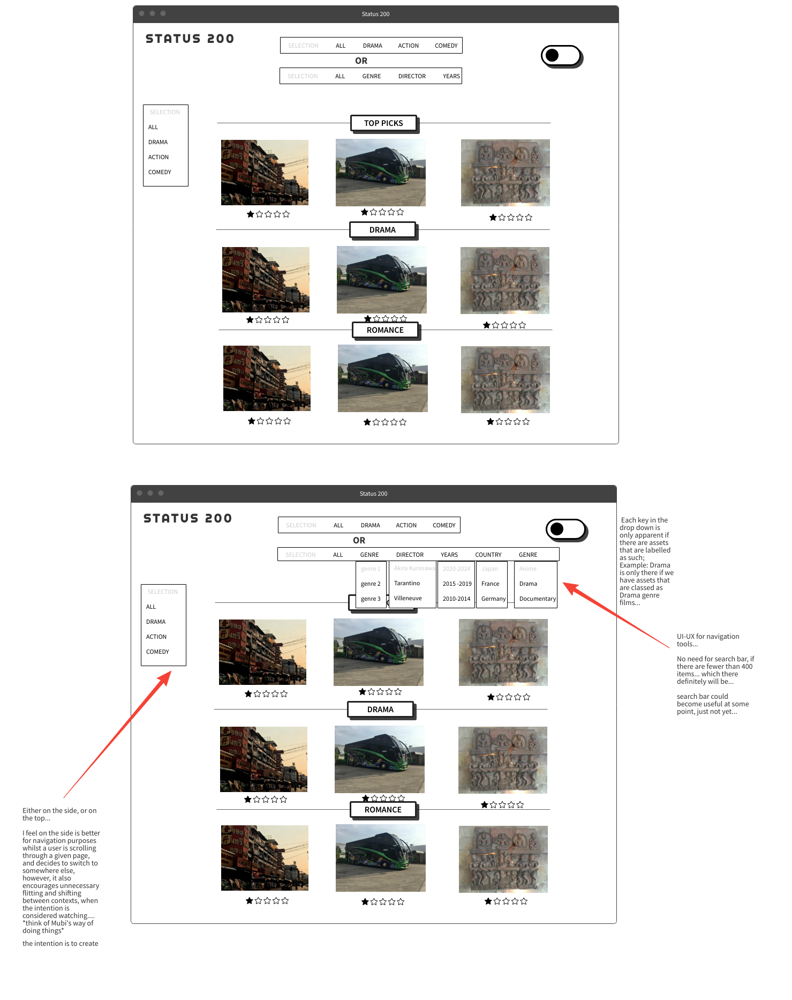

# PirateHub

This is the _alpha_ version

# To run

Currently, `.env` file is ignored from version control.
In order for it to run, write your own `.env` with necessary credentials.
Currently the logs/app.log and logs/app_error.log is not automatically
created. In order for the app to run do:


.Build the database locally:
```
bundle exec rake db:create
bundle exec rake db:migrate
touch logs/app.log logs/app_error.log
```

A message will appear in the monitoring panel to inform whether there is a discrepancy
between what is currently stored in Mux, and what is in the database (your local database).

.Make the log files:
```
mkdir logs
touch logs/app.log logs/app_error.log
```

.Then create the env file:
```
touch .env
```

.inside the `.env`:
```
MUX_TOKEN_ID=[your mux ID token]
MUX_TOKEN_SECRET=[your mux token secret key]
```

:NOTE: perhaps these keys should be put inside of the GitHub env variables.

_To run the app:_

.Install dependencies:
```
bundle install
```

.Run the app:
```
rackup
```

# Plan

_To be inserted, currently in Obisidian_

# Notes
_To be inserted, currently in Obisidian_


.Notes on attaching metadata to an asset
```ruby
  def special_endpoint
        # API Client Initialization #
        assets_api = MuxRuby::AssetsApi.new
        playback_ids_api = MuxRuby::PlaybackIDApi.new
        uploads_api = MuxRuby::DirectUploadsApi.new
        # ========== create-direct-upload ==========
        create_asset_request = MuxRuby::CreateAssetRequest.new
        create_asset_request.playback_policy = [MuxRuby::PlaybackPolicy::PUBLIC]

        create_upload_request = MuxRuby::CreateUploadRequest.new

        # TRY AND PUT THE FORM SOMEWHERE IN HERE FOR PASSING IN TITLE, DESCRIPTION, and TAG....
        # def add_metadata(playbackID, ASSETID, title, description, tags)
        # put title in data base
        # put ASSETID in db
        # put playbackID in db
        # put description in db
        # end

        # If you cant do it this way, then you can first upload the file
        #and then submit the details after by taking the last entry, and updating the last entry

        # So it would upload, the bar would load and fill as it does,
        # and then the user would need to upload the details and metadata after
        # and click "submit"

        create_upload_request.new_asset_settings = create_asset_request
        create_upload_request.timeout = 3600
        create_upload_request.cors_origin = "http://localhost:9292/admin"

        upload = uploads_api.create_direct_upload(create_upload_request)

        endpoint= upload.data.url
        endpoint
  end

# TODO:extract the playback ID and allow input for title,
# description, tags/genre to be inserted and updated,
# for the admin to change.

```

So what we need to do:
create a post route for submitting title and description
that is stored in database
Should this be one thing, or two separate elements:
if they are two separate elements and one fails, then it could still have a video but not title
Lets try it a fe ways...

_Use this to get the asset information of the last thing that you uploaded_:

[mux doc on getting a directupload's info](https://soleetal.com/products/sole-et-al-raws-heavyweight-double-layer-tee-black?currency=GBP&variant=47684840489263&utm_medium=cpc&utm_source=google&utm_campaign=Google+Shopping&stkn=2574fade4b08&tw_source=google&tw_adid=693340036694&tw_campaign=21079978443&gad_source=1&gclid=Cj0KCQjwwYSwBhDcARIsAOyL0fh9zXeFjCSvvVjRMy3k4YbrEUbjSrb8FjvtWg4D3WGmpS5la-SYGgkaAiNwEALw_wcB)


# Resources

_To be inserted, currently in Obisidian_

- Mux assets:

https://dashboard.mux.com/organizations/vkhb2l/environments/pdndb2/video/assets

- Mux upload a video:

https://docs.mux.com/guides/mux-uploader#upload-a-video

- Mux for creating a new direct upload URL:
https://docs.mux.com/api-reference#video/operation/create-direct-upload

- Mux slot reference:
https://docs.mux.com/guides/mux-uploader#slots-reference


- mux-ruby-sdk on github:
https://github.com/muxinc/mux-ruby?tab=readme-ov-file


- Consulted for uploading a file:
https://azemoh.com/2016/05/17/sinatra-managing-file-uploads/


# Sandbox code:

```
# # Wait for the asset to become ready...
# if create_response.data.status != 'ready'
#   puts "    waiting for asset to become ready..."
#   while true do
#     # ========== get-asset ==========
#     if asset.data.status != 'ready'
#       puts "Asset not ready yet, sleeping..."
#       sleep(1)
#     else
#       puts "Asset ready checking input info."
#       # ========== get-asset-input-info ==========
#       input_info = assets_api.get_asset_input_info(asset.data.id)
#       break
#     end
#   end
# end
# puts "get-asset OK ✅"
# puts "get-asset-input-info OK ✅"
```

  post '/upload_new_asset' do

      # ===================================================
      # ========== This is where the mess begins ==========
      # ===================================================

      # API Client Initialization #
      assets_api = MuxRuby::AssetsApi.new
      playback_ids_api = MuxRuby::PlaybackIDApi.new
      uploads_api = MuxRuby::DirectUploadsApi.new

      # Params processing for file #
      # input_new_video = params[:new_video]
      # file_for_new_video = params[:new_video][:tempfile].read
      uploaded_file = params[:new_video]
      # puts "This is the filename: #{uploaded_file[:new_video][:filename]}"
      file_path = uploaded_file[:tempfile].path
      # puts input_new_video

      # ========== create-direct-upload ==========
      create_asset_request = MuxRuby::CreateAssetRequest.new
      create_asset_request.playback_policy = [MuxRuby::PlaybackPolicy::PUBLIC]

      create_upload_request = MuxRuby::CreateUploadRequest.new

      create_upload_request.new_asset_settings = create_asset_request
      create_upload_request.timeout = 3600
      create_upload_request.cors_origin = "http://localhost:9292/admin"

      upload = uploads_api.create_direct_upload(create_upload_request)


      endpoint= upload.data.url

      puts "=+=+=+=+=+=+=+=+=+=+=+=+=+=+=+"
      puts "The ID we get is this: #{upload.data.id}"
      puts "~~~~~~~~~~~~~~~~~~~~~~~~~~~~~~~~~~~"
      assets = assets_api.list_assets()
      puts "This could be what we need: #{assets.data}"
      puts "=+=+=+=+=+=+=+=+=+=+=+=+=+=+=+"
      puts "This is the last upload: #{assets.data.last}"

      puts "*******************************"

      puts "Listing Direct Uploads:\n\n"
      uploads = uploads_api.list_direct_uploads()
      uploads.data.each do | upload |
        puts "Status: #{upload.status}"
        puts "Asset ID: #{upload.asset_id}\n\n"
      end

      puts "This is the first upload: #{assets.data.first}"
      puts "=+=+=+=+=+=+=+=+=+=+=+=+=+=+=+"
      puts "The data for uploads_api we get is this: #{uploads_api.get_direct_upload(upload.data.id)}"
      puts "=+=+=+=+=+=+=+=+=+=+=+=+=+=+=+"

      upload_file(file_path, endpoint)
      # endpoint = signed_upload_url + '/' + file_name_for_new_video


      # create_asset_request.input = file_for_new_video
      # create_response = assets_api.create_asset(create_asset_request)

      puts "create-asset OK ✅"
      # @signed_upload_url = endpoint + '/' + uploaded_file[:new_video][:filename]

      redirect '/'

  #   e

## Documentation

- Mux [upload a video]
- Mux for creating a [new direct upload URL]
- Mux [slot reference]
- [mux-ruby-sdk] on github


Consulted for [uploading a file].

[upload a video]: https://docs.mux.com/guides/mux-uploader#upload-a-video
[new direct upload URL]: https://docs.mux.com/api-reference#video/operation/create-direct-upload
[slot reference]: https://docs.mux.com/guides/mux-uploader#slots-reference
[mux-ruby-sdk]: https://github.com/muxinc/mux-ruby?tab=readme-ov-file
[uploading a file]:https://azemoh.com/2016/05/17/sinatra-managing-file-uploads/


## Resources for USer IP data:

https://www.ip2location.io

https://www.ip2location.com

Going to try this one:

https://ipwhois.io will not use this one yet as the security data is only accessible when paid for...

This seems to be a good article on identifying the good services to use:

https://medium.com/the-era-of-apis/top-10-best-ip-geolocation-apis-210e3f568b63

Need to talk about the above with KOTP as need to establish the correct API to use from the get go before setting up the methods to extract the correct info...


## Organising code base

Consider Sinatra partials gem: https://github.com/yb66/Sinatra-Partial

## Mux customisation css

https://docs.mux.com/guides/player-customize-look-and-feel

## Notes on preliminary data extraction design and config

### Backend client data extraction

Alongside what is currently in place, set up scripting to extract the
client IP details and serve them to a page.
Potentially log them later on, either in a log file, or by creating a
user and updataing a database that could either be hosted in RDS on a
relational database...

Or creating a csv file, storing it in AWS S3, and updating that each
time a user clicks on the site...logging that info...

Potentially set up AWS SNS so that each time there is an event,it logs
the data and an email is sent... this could be a good idea.

The first option would require:

sinatra active record
a User model
a database
an admin view for viewing all of the users, but this might not make
sense, or would it?


The second option would involve just logging the fleeting information of
users passing through.
It seems that using the first option, it may be easier to actually find
users that have visited more that once simply by writing a method to do
so... the amount of code involve could potentially be identical in the
long run

It would also allow me to block the page from specific users according
to their IP address if I want...

As a first iteration, we will log the user data to the index page,
and see if we can actually do that for one request.
If we can, we will explore the other options.

### Front end

Two options again:

Either store the images on the actual page and serve them that way...
The second option would be to store the images in an S3 bucket

Storing them locally could be the easier of the two options,
and since they are supposed to be public anyway, why not?

### APIs I'll play with

#### IPSTACK (first one)
[docs]https://ipstack.com/documentation

#### IPINFO

[docs](https://ipinfo.io/developers)


#### IPGEOLOCATION

[docs](https://ipgeolocation.io/what-is-my-ip/)

#### IPAPI

https://ipapi.co/#paid-vs-free

This one is the most accurate one geolcation wise...


#### VPNAPI

https://vpnapi.io/pricing

This one has the security options

I'll start with this one... this one seems to be the best...

login: https://vpnapi.io/dashboard?verified=success

Used this source: https://www.twilio.com/en-us/blog/5-ways-make-http-requests-ruby


#### Connecting an EC2 instance with Postgresql

https://medium.com/@pantaanish/setting-up-postgresql-on-an-ec2-instance-a-step-by-step-guide-9be2e3348fdb


#### Research on search functionality

https://www.algolia.com/blog/ux/mobile-search-ux-best-practices/


https://www.youtube.com/watch?v=L0Pk3OVbxRU&ab_channel=DesignSpo


# Glitch the title:

https://www.youtube.com/watch?v=W5oawMJaXbU&ab_channel=Hyperplexed

# UX/UI wireframes

Considerations for user experience and usage specifically relating to search and navigation functionality regarding assets available for viewing...




# Bycrypt

https://utahedu.devcamp.com/sie2017/guide/using-bcrypt-to-implement-encryption-in-ruby


# formbutton docs used for the suggestion form

https://formspree.io/formbutton/docs/#customizing-formbutton


# Comparison

https://www.stumfilm.dk/en/stumfilm/streaming/film/20682


# Known bugs or errors

- error on line 173:
It seems that now that `@ip_address = request.ip` the app controller will fail as the vpn api checks will use an ip address of ::1 which will not be able to return anything...

Something should be done to distinguish between both modes then...

- ajax not working on mobile as in desktop
the result of this is that we do not get the time spent on site for mobile users