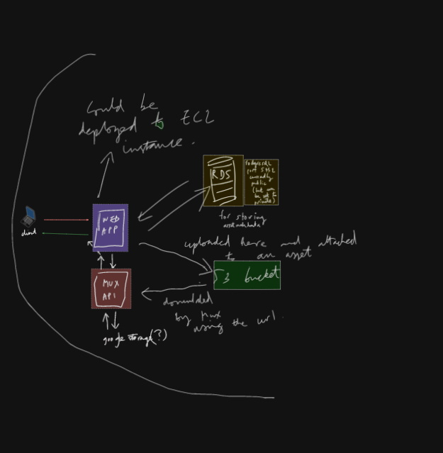

# Video streaming app

This application allows you to stream videos seamlessly. It integrates with Mux for media hosting and offers functionalities like uploading assets (for an admin account only), managing metadata(for an admin only), and tracking user activity(for an admin only).

This version is currently in the alpha stage, meaning it's a work in progress with core features already functional but not yet polished for production use.

Feel free to explore the codebase, contribute, or simply try out the app by cloning it locally and using your own API keys.

This is the _alpha_ version, and is currently not GDPR compliant.
Much of what exists is built in a spike, with ideation for future features and functionality in mind.

# To run

Currently, `.env` file is ignored from version control.
In order for it to run, write your own `.env` with necessary credentials.
Currently the logs/app.log and logs/app_error.log is not automatically
created. In order for the app to run do:


*Build the database locally:*
```
bundle exec rake db:create
bundle exec rake db:migrate
touch logs/app.log logs/app_error.log
```

A message will appear in the monitoring panel to inform whether there is a discrepancy
between what is currently stored in Mux, and what is in the database (your local database).

*Make the log files:*
```
mkdir logs
touch logs/app.log logs/app_error.log
```

*Then create the env file:*
```
touch .env
```

*inside the `.env`:*
```sh
# Include your own keys and credential values:
# =+=+=+=+=+=+=+=+=+=+=+=+=+=+=+=+=+=+=+=+
# *******      MUX TOKEN         *********
# =+=+=+=+=+=+=+=+=+=+=+=+=+=+=+=+=+=+=+=+

MUX_TOKEN_ID=[your mux ID token]
MUX_TOKEN_SECRET=[your mux token secret key]

# =+=+=+=+=+=+=+=+=+=+=+=+=+=+=+=+=+=+=+=+
# *******    AWS S3 TOKENS       *********
# =+=+=+=+=+=+=+=+=+=+=+=+=+=+=+=+=+=+=+=+

S3_ACCESS_KEY=[aws_s3_access_key]
S3_SECRET_KEY=[aws_s3_secret_key]

# =+=+=+=+=+=+=+=+=+=+=+=+=+=+=+=+=+=+=+=+
# ***  AWS DB TOKENS(on EC2 instance)  ***
# =+=+=+=+=+=+=+=+=+=+=+=+=+=+=+=+=+=+=+=+
EC2_PGSQL_DB_USERNAME=[ec2_pgsql_db_username]
EC2_PGSQL_DB_PASSWORD=[ec2_pgsql_db_password]
EC2_DATABASE_HOST=[ec2_db_host]
PGSQL_PORT=[pgsql_port]
EC2_DB_NAME=[ec2_db_name]

# =+=+=+=+=+=+=+=+=+=+=+=+=+=+=+=+=+=+=+=+
# *******    USER METRICS        *********
# =+=+=+=+=+=+=+=+=+=+=+=+=+=+=+=+=+=+=+=+

VPNAPI_ACCESS_KEY=[vpnapi_access_key]
API_FOR_GETTING_DATA="https://vpnapi.io/api/%{ip_address}?key=%{api_key}"
TEST_IP_ADDRESS=[test_ip_address]

# =+=+=+=+=+=+=+=+=+=+=+=+=+=+=+=+=+=+=+=+
# *******    ADMIN LOGIN         *********
# =+=+=+=+=+=+=+=+=+=+=+=+=+=+=+=+=+=+=+=+
ADMIN_PASSWORD=[admin_password]

# =+=+=+=+=+=+=+=+=+=+=+=+=+=+=+=+=+=+=+=+
# *******    USER LOGIN          *********
# =+=+=+=+=+=+=+=+=+=+=+=+=+=+=+=+=+=+=+=+
USER_PASSWORD=[private_user_password]
```

:NOTE: these keys can also be put inside of the GitHub env variables for a production environment scenario.

_To run the app:_

.Install dependencies:
```
bundle install
```

.Run the app:
```
rackup
```

# UX/UI wireframes

Considerations for user experience and usage specifically relating to search and navigation functionality regarding assets available for viewing...


# Plan

_A very rough outline of what the app architecture was intended to look like prior to build_
.

# Resources

_Use this to get the asset information of the last thing that you uploaded_:

[mux doc on getting a directupload's info](https://soleetal.com/products/sole-et-al-raws-heavyweight-double-layer-tee-black?currency=GBP&variant=47684840489263&utm_medium=cpc&utm_source=google&utm_campaign=Google+Shopping&stkn=2574fade4b08&tw_source=google&tw_adid=693340036694&tw_campaign=21079978443&gad_source=1&gclid=Cj0KCQjwwYSwBhDcARIsAOyL0fh9zXeFjCSvvVjRMy3k4YbrEUbjSrb8FjvtWg4D3WGmpS5la-SYGgkaAiNwEALw_wcB)


- Mux assets:

https://dashboard.mux.com/organizations/vkhb2l/environments/pdndb2/video/assets

- Mux upload a video:

https://docs.mux.com/guides/mux-uploader#upload-a-video

- Mux for creating a new direct upload URL:
https://docs.mux.com/api-reference#video/operation/create-direct-upload

- Mux slot reference:
https://docs.mux.com/guides/mux-uploader#slots-reference

- mux-ruby-sdk on github:
https://github.com/muxinc/mux-ruby?tab=readme-ov-file

- Consulted for uploading a file:
https://azemoh.com/2016/05/17/sinatra-managing-file-uploads/


## Documentation annex

Documentation that is useful for development:

- Mux [upload a video]
- Mux for creating a [new direct upload URL]
- Mux [slot reference]
- [mux-ruby-sdk] on github


Consulted for [uploading a file].

[upload a video]: https://docs.mux.com/guides/mux-uploader#upload-a-video
[new direct upload URL]: https://docs.mux.com/api-reference#video/operation/create-direct-upload
[slot reference]: https://docs.mux.com/guides/mux-uploader#slots-reference
[mux-ruby-sdk]: https://github.com/muxinc/mux-ruby?tab=readme-ov-file
[uploading a file]:https://azemoh.com/2016/05/17/sinatra-managing-file-uploads/

1. Organising code base

Consider Sinatra partials gem: https://github.com/yb66/Sinatra-Partial

2. Mux customisation css

https://docs.mux.com/guides/player-customize-look-and-feel

3. User IP Data Extraction and Logging

The app extracts and logs user IP data to enhance monitoring, tracking, and potential user management. This feature helps gather geographical and network-related data from users accessing the platform, which can be used for a variety of purposes, including security, analytics, and personalization. As it stands, since this is not a paid for service and there is no user agreement, this version is not GDPR compliant. An alternative solution would be to integrate firewall rules onto a cloud server, but that would necessitate hosting the app somewhere with more granular configuration possible than Heroku (AWS, or Azure).

_How It Works_
IP Data Extraction: The app extracts the user's IP address and other related information, such as geographical location (city, country, region) and network details (ISP, VPN status, etc.), from an external IP geolocation API. 

* Logging and Storing Data: This data can be logged either:

- In a database...
... using Sinatra’s ActiveRecord to store the information in a User model, which can later be viewed via an admin panel. This option would allow detailed user tracking and the ability to find users who have visited multiple times.

- Or in a log file or CSV file...
... stored in AWS S3 for a simpler approach, particularly for a less complex system.

- Further Considerations: 
AWS SNS could be used to trigger notifications (such as emails) whenever specific user activities occur. This could be useful for monitoring suspicious activities or tracking engagement.

_Why This Is Useful_
Security: Identifying users based on IP addresses can help in blocking or restricting certain users from accessing the site, especially in case of suspicious activity.

* Analytics: 
Tracking geographical and network information allows for gathering insights on user demographics and engagement levels.

* User Management:
Storing and logging IP data helps track returning users, providing a better understanding of user behavior and potentially enabling features such as personalization.

By implementing this feature in stages, starting with logging user data to the index page, the app can gradually move toward a more comprehensive data extraction and management system.


### APIs for user metrics

1. IPSTACK (first one)
[docs](https://ipstack.com/documentation)

2. IPINFO

[docs](https://ipinfo.io/developers)

3. IPGEOLOCATION

[docs](https://ipgeolocation.io/what-is-my-ip/)

4. IPAPI

https://ipapi.co/#paid-vs-free

This one is the most accurate one geolcation wise...

5. VPNAPI

https://vpnapi.io/pricing

This one has the security options

I'll start with this one... this one seems to be the best...

#### Connecting an EC2 instance with Postgresql

https://medium.com/@pantaanish/setting-up-postgresql-on-an-ec2-instance-a-step-by-step-guide-9be2e3348fdb

#### Research on search functionality

https://www.algolia.com/blog/ux/mobile-search-ux-best-practices/

https://www.youtube.com/watch?v=L0Pk3OVbxRU&ab_channel=DesignSpo

# Known bugs or errors

The app is not currently running due to AWS account neglect and issues. These should first be resolved and the relevant resources will need to be remade before the app is up and running and again.

- error on line 173:
It seems that now that `@ip_address = request.ip` the app controller will fail as the vpn api checks will use an ip address of ::1 which will not be able to return anything...

Something should be done to distinguish between both modes then...

- ajax not working on mobile as in desktop
the result of this is that we do not get the time spent on site for mobile users

#### Command for extracting srt out of an mkv file

```sh
ffmpeg -i [path_to_media_document].mkv -map 0:s:0 subs.srt
```

#### Turbo Frames and Streams on Sinatra

https://gist.github.com/radanskoric/9bdaa8f64289b00b3cfb1d35cd889196

#### Transform non .srt subs to .srt

https://subtitletools.com/
